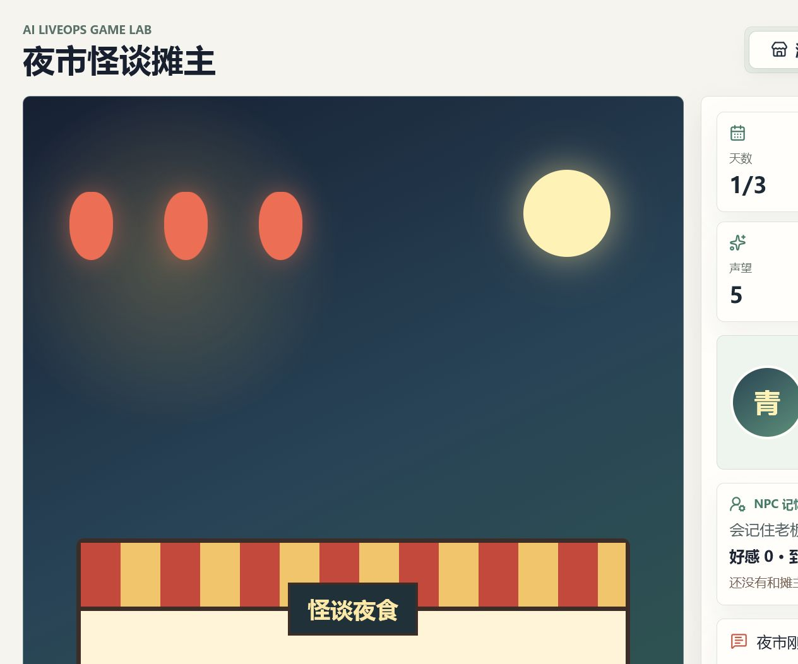
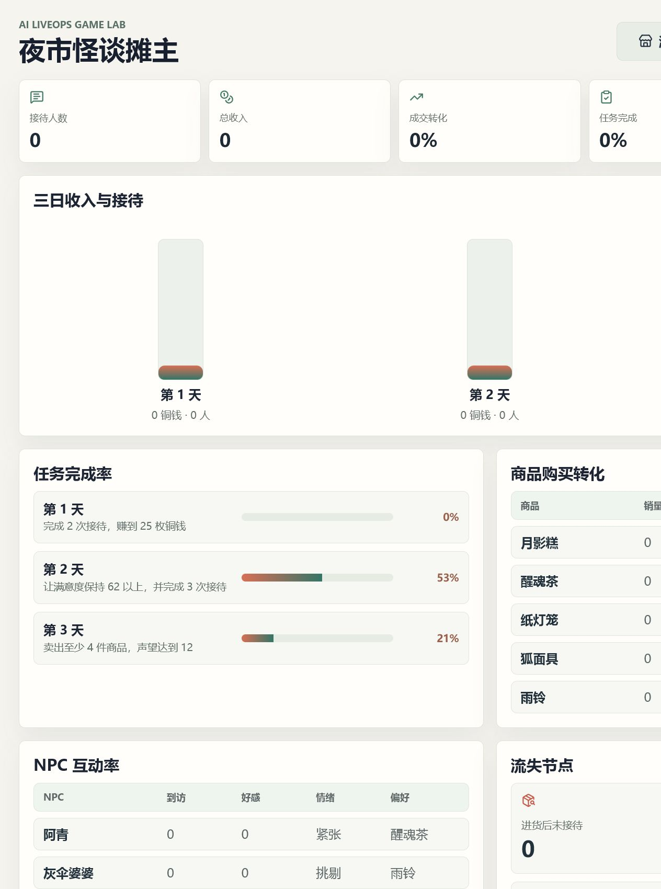
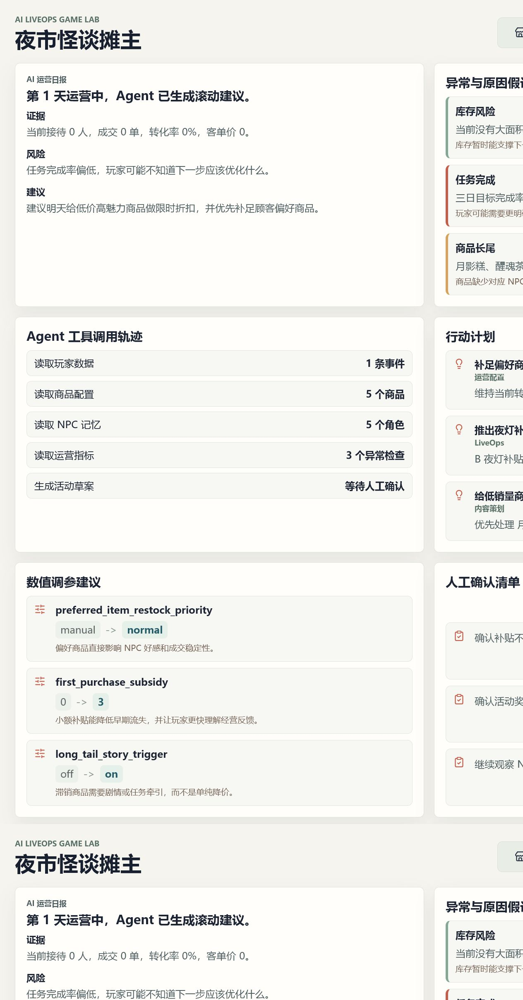
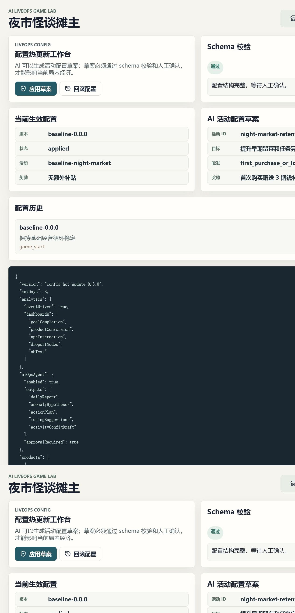

# 夜市怪谈摊主

## 3 分钟亮点

这是一个把“小游戏玩法、运营数据、AI Agent、配置热更新、桌面交付”串起来的作品集项目。

不会使用命令行的 Windows 用户，可以直接双击仓库根目录的 `启动游戏.cmd`。它会在首次运行时自动准备桌面版程序，之后直接打开游戏。

核心闭环：

```text
玩家经营夜市 -> 事件埋点 -> 运营诊断 -> AI Agent 生成建议和配置草案 -> 人工确认 -> 配置影响下一轮游戏
```
游戏的重点：

1. 不只是小游戏，而是面向上线后运营的 LiveOps 工具雏形。
2. 不只是 AI 文案，而是可解释、可审计、可回滚的 Agent 工程链路。
3. 不只是网页 Demo，也提供 Tauri 桌面端和 Windows 安装包构建能力。

## 功能清单

当前已经完成 Web MVP、NPC Agent、运营数据后台、AI 运营 Agent、配置热更新工作台、Tauri 桌面应用和作品集演示材料：

1. 三天夜市经营循环。
2. 进货、接待 NPC、销售和收摊结算。
3. 基础事件埋点。
4. 运营数据看板。
5. 本地模拟 AI 运营日报和活动配置草案。
6. 配置驱动视图、schema 校验、人工确认和回滚。
7. NPC 角色偏好、预算、厌恶项、动态情绪和结构化记忆。
8. NPC Agent 工具轨迹：读取库存、价格、NPC 记忆和任务状态。
9. Agent 页展示最近一次 NPC 决策、规则边界和 NPC 记忆账本。
10. 运营后台展示任务完成率、商品购买转化、NPC 互动率、流失节点和基础 A/B 测试。
11. AI 运营 Agent 基于运营指标生成日报、异常原因假设、行动计划、调参建议和活动配置草案。
12. 配置工作台支持 schema 校验、人工确认、应用草案、配置历史和回滚。
13. 应用配置后可以实际影响局内经济，例如首购补贴和偏好商品补货成本。
14. Tauri 桌面端整合现有游戏、运营后台、AI 工作台和配置工作台。
15. 作品集演示脚本、面试讲解材料和关键界面截图。

## 截图









## 本地运行

```bash
npm install
npm run dev
```

## 构建

```bash
npm run build
```

## 桌面端

```bash
npm run desktop:dev
npm run desktop:build
```

Windows 安装包生成位置：

```text
src-tauri/target/release/bundle/nsis/AI LiveOps Night Market_1.0.0_x64-setup.exe
```

## 演示材料

1. [演示脚本](docs/DemoScript.md)
2. [面试讲解材料](docs/InterviewGuide.md)
3. [架构说明](docs/Architecture.md)
4. [Agent 设计记录](docs/PromptAndAgentDesign.md)
5. [创新点记录](docs/InnovationLog.md)

## 当前版本

```text
v1.0.0-portfolio-demo
```

## 版本管理

远程仓库固定为：

```text
https://github.com/Ey1afjalla/second-game.git
```

作者：赵秋阳
