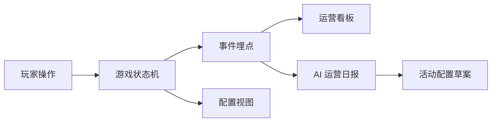

# 架构说明

## 当前版本

当前版本是 Web MVP，采用单前端应用：

## 模块划分

1. 游戏主界面：承载夜市场景、NPC 接待、补货和收摊。
2. 运营看板：展示接待、收入、成交转化、流失和日维度数据。
3. Agent 工作台：展示运营日报、工具调用轨迹和配置草案。
4. 配置视图：展示商品与活动配置结构，为后续热更新做准备。

## 后续演进

1. 抽离游戏规则到独立模块。
2. 引入后端服务保存事件和配置。
3. 接入真实模型 API，让 Agent 读取工具结果后生成报告。
4. 引入 schema 校验、配置历史和回滚。
5. 使用 Tauri 封装桌面应用。
