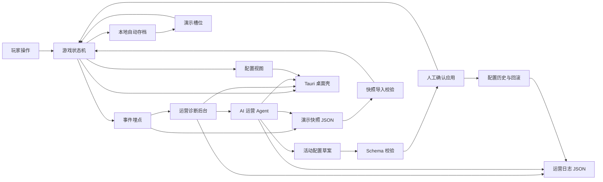

# 架构说明

## 当前版本

当前版本是 Web 应用加 Tauri 桌面壳。业务逻辑仍集中在 React 前端，Tauri 负责本地启动、窗口承载和桌面打包：

## 模块划分

1. 游戏主界面：承载夜市场景、NPC 接待、补货和收摊。
2. 运营诊断后台：展示接待、收入、成交转化、任务完成、商品转化、NPC 互动、流失节点和 A/B 对比。
3. Agent 工作台：展示运营日报、异常假设、行动计划、调参建议、工具调用轨迹和配置草案。
4. 配置工作台：展示商品、运营分析和 Agent 配置结构，支持 schema 校验、人工确认、应用、历史记录和回滚。
5. 本地持久化：使用 `localStorage` 自动保存当前演示进度，支持 3 个本地演示槽位，并支持导出或导入包含事件流、关键指标、Agent 报告和配置草案的 JSON 快照；运营页还能导出包含工具轨迹和配置历史的本地运营日志 JSON。
6. Tauri 桌面壳：复用 Web 版本，提供本地窗口、开发启动和 Windows 安装包构建能力。

## 后续演进

1. 抽离游戏规则到独立模块。
2. 引入后端服务保存事件和配置。
3. 引入真实实验分流，给 A/B 测试增加实验 ID、样本量和显著性判断。
4. 接入真实模型 API，让 Agent 读取工具结果后生成报告。
5. 将前端配置历史和本地存档迁移到后端或 Tauri 本地 SQLite。
6. 增加桌面端菜单和更完整的存档文件管理。
